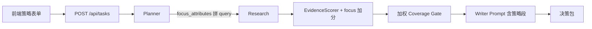

# TRAE 交接文档：AnalysisProfile 可调整权重分析策略

> 更新日期：2026-06-16  
> 目标：让竞品分析支持「定价优势 / 产品力优势 / 性价比 / 自定义权重」，AI 按用户策略动态加权采集、评分与输出决策  
> **后端核心已落地约 90%，剩余工作集中在前端 UI + OpenAPI 类型 + 测试**

---

## 0. 给 TRAE 的一句话

**不要从零设计 AnalysisProfile——后端 schema / workflow / scorer / store 已实现。你的任务是：补全前端策略选择器 + 权重滑块 + 关注属性多选，把 `analysis_profile` 随 `createTask` 提交，更新 `openapi.d.ts`，补 3～5 个 pytest，跑通手持小风扇 demo。**

---

## 1. 业务背景（为什么要做）

对手持小风扇这类消费品，用户可能有两种竞争思路：

| 策略 | 用户意图 | AI 应侧重 |
|------|----------|-----------|
| **定价优势** (`cost_leadership`) | 以低价/性价比打市场 | pricing 权重高，必达 pricing + feature + user_feedback |
| **产品力优势** (`performance`) | 风力、静音、续航等参数碾压 | feature + user_feedback 权重高 |
| **性价比导向** (`hybrid`，默认) | 同价位最优解 | 三维均衡，交叉验证 |
| **自定义权重** (`custom`) | 用户手动调各维度权重 | 按 slider 值加权 coverage + writer prompt |

此外用户可选 **关注属性**（如「风力、噪音、续航、价格」），影响：

- Planner 生成的 search query
- EvidenceScorer 的 relevance 加分
- Writer prompt 中的分析指引

---

## 2. 已完成清单 ✅（勿重复实现）

### 2.1 Schema（`ci-agent/backend/app/models/schemas.py`）

已实现：

- `AnalysisStrategy` 枚举：`cost_leadership | performance | hybrid | custom`
- `STRATEGY_PRESETS`：各策略的默认权重 + 必达维度
- `AnalysisProfile` 模型：
  - `strategy`
  - `dimension_weights`（custom 模式下自动归一化）
  - `focus_attributes: list[str]`
  - `our_product_hints: str | None`
  - `resolved_weights()` / `mandatory_dimensions()` / `strategy_label()`
- `TaskCreateRequest.analysis_profile: AnalysisProfile`（默认 hybrid）

### 2.2 Workflow（`ci-agent/backend/app/worker/workflow.py`）

已实现：

- `_get_profile` / `_get_mandatory_dimensions` / `_get_scoring_context`
- `_build_strategy_writer_section` → 注入 Writer prompt
- `_build_focus_search_query` → Planner 按 focus_attributes 生成 search 任务
- `_compute_coverage` → **加权 coverage 评分**（`COVERAGE_PASS_THRESHOLD = 0.7`）
- `planner` 事件日志含策略名与关注属性
- `evidence_normalizer` / `_supplement_search` 传递 `focus_attributes` 给 scorer

### 2.3 EvidenceScorer（`ci-agent/backend/app/services/evidence_scorer.py`）

已实现：

- `score(evidence, context, focus_attributes=None)`
- focus_attributes 命中 evidence 文本时 relevance +0.08（上限 +0.24）

### 2.4 持久化（`store.py` + `db/models.py`）

已实现：

- `TaskDB.analysis_profile` JSON 列
- create 时 `model_dump(mode="json")` 写入
- `_deserialize_request` 读取还原

### 2.5 已知限制（可留到后续）

- 旧 SQLite 库若已存在 `tasks` 表，`create_all` **不会**自动加 `analysis_profile` 列 → 需删库重建或手写 migration（见 §6）
- `run_fallback` 串行 research 路径未单独为 focus_attributes 加 pricing search（planner 路径已有）
- 前端 **完全未接** analysis_profile

---

## 3. TRAE 待办清单 ❌

```text
优先级 P0（必须）
  [ ] 前端 App.vue：分析策略 UI + submitTask 传 analysis_profile
  [ ] frontend/src/services/openapi.d.ts：补 AnalysisProfile / AnalysisStrategy 类型
  [ ] loadDemoData 同步 demo 策略默认值

优先级 P1（建议）
  [ ] backend/tests：AnalysisProfile 校验 + coverage 加权 + writer prompt 含策略
  [ ] 任务结果页展示当前策略（读 currentTask.request.analysis_profile）
  [ ] README / TRAE_MASTER_PLAN 验收表更新一行

优先级 P2（可选抛光）
  [ ] GET /api/strategies 返回预设列表（免 hardcode 前端）
  [ ] 策略切换时自动填充 focus_attributes 建议值
  [ ] Alembic migration for analysis_profile 列
```

---

## 4. API 契约

### 4.1 请求体扩展

`POST /api/tasks` 的 `TaskCreateRequest` 增加可选字段：

```json
{
  "product_goal": "为一款手持小风扇产品寻找差异化定位...",
  "competitors": ["几素高速节能手持小风扇", "铁布衫手持风扇"],
  "competitor_urls": [...],
  "analysis_profile": {
    "strategy": "hybrid",
    "dimension_weights": {
      "feature": 0.30,
      "pricing": 0.25,
      "user_feedback": 0.25,
      "positioning": 0.10,
      "risk": 0.10
    },
    "focus_attributes": ["风力", "噪音", "续航", "价格"],
    "our_product_hints": "我方成本可控，可在同价位提供更高风速"
  }
}
```

**注意：**

- 非 `custom` 策略时，后端 **忽略** 客户端传的 `dimension_weights`，使用 `STRATEGY_PRESETS` 预设
- `custom` 策略时，权重会自动归一化为总和 1.0
- 省略 `analysis_profile` 时默认 `strategy: hybrid`、空 focus_attributes

### 4.2 策略预设值（前端可 hardcode，与后端一致）

| strategy | 中文标签 | feature | pricing | user_feedback | positioning | risk |
|----------|----------|---------|---------|---------------|-------------|------|
| cost_leadership | 定价优势 | 0.20 | **0.40** | 0.25 | 0.10 | 0.05 |
| performance | 产品力优势 | **0.35** | 0.15 | **0.30** | 0.10 | 0.10 |
| hybrid | 性价比导向 | 0.30 | 0.25 | 0.25 | 0.10 | 0.10 |
| custom | 自定义权重 | 用户可调 | 用户可调 | 用户可调 | 用户可调 | 用户可调 |

### 4.3 维度 key（与 EvidenceDimension 一致）

```text
feature | pricing | positioning | user_feedback | risk
```

前端展示建议中文映射：

```text
feature → 产品特性
pricing → 定价
user_feedback → 用户反馈
positioning → 市场定位
risk → 风险/短板
```

---

## 5. 前端实现规格（`ci-agent/frontend/src/App.vue`）

### 5.1 表单 state 扩展

在 `form` reactive 中增加：

```typescript
const FOCUS_ATTRIBUTE_OPTIONS = ["风力", "噪音", "续航", "价格", "便携", "静音", "档位", "充电"];

const STRATEGY_OPTIONS = [
  { value: "hybrid", label: "性价比导向", desc: "同价位最优解，均衡对比参数与价格" },
  { value: "cost_leadership", label: "定价优势", desc: "重点分析价差、促销与同价位参数" },
  { value: "performance", label: "产品力优势", desc: "重点分析风力、噪音、续航等核心参数" },
  { value: "custom", label: "自定义权重", desc: "手动调整各维度权重" },
];

const DIMENSION_LABELS: Record<string, string> = {
  feature: "产品特性",
  pricing: "定价",
  user_feedback: "用户反馈",
  positioning: "市场定位",
  risk: "风险/短板",
};

const DEFAULT_WEIGHTS: Record<string, number> = {
  feature: 0.30,
  pricing: 0.25,
  user_feedback: 0.25,
  positioning: 0.10,
  risk: 0.10,
};

// 加入 form:
analysisStrategy: "hybrid" as "cost_leadership" | "performance" | "hybrid" | "custom",
dimensionWeights: { ...DEFAULT_WEIGHTS },
focusAttributes: ["风力", "噪音", "续航", "价格"] as string[],
ourProductHints: "",
```

### 5.2 UI 布局（插入位置：「产品目标」与「竞品名称」之间，或竞品名称之后）

```text
┌─ 分析策略 ─────────────────────────────────────┐
│  ○ 性价比导向  ○ 定价优势  ○ 产品力  ○ 自定义   │  ← el-radio-group
│  策略说明一行小字                                │
├─ 关注属性（多选）──────────────────────────────│
│  [风力] [噪音] [续航] [价格] [便携] ...         │  ← el-checkbox-group 或 el-select multiple
├─ 我方产品提示（可选）──────────────────────────│
│  textarea placeholder="已知优势、成本结构..."    │
├─ 维度权重（仅 custom 时显示）──────────────────│
│  产品特性  ████████░░  30%                       │  ← el-slider 0-100，5 个维度
│  定价      ██████░░░░  25%                       │
│  ...                                             │
│  提示：滑块会自动归一化，无需手动凑 100%          │
└────────────────────────────────────────────────┘
```

### 5.3 交互逻辑

1. **策略切换**
   - 选 `custom` → 显示 5 个 slider，初始值为 `DEFAULT_WEIGHTS`
   - 选其他策略 → 隐藏 slider；submit 时可不传 `dimension_weights`（后端用 preset）

2. **focus_attributes**
   - 切换策略时可 **可选** 自动推荐：
     - cost_leadership → `["价格", "续航", "便携"]`
     - performance → `["风力", "噪音", "续航"]`
     - hybrid → `["风力", "噪音", "续航", "价格"]`

3. **submitTask 改造**

```typescript
const analysisProfile = computed(() => {
  const base = {
    strategy: form.analysisStrategy,
    focus_attributes: form.focusAttributes,
    our_product_hints: form.ourProductHints.trim() || undefined,
  };
  if (form.analysisStrategy === "custom") {
    return {
      ...base,
      dimension_weights: { ...form.dimensionWeights },
    };
  }
  return base;
});

// createTask 增加:
analysis_profile: analysisProfile.value,
```

4. **loadDemoData** 同步：

```typescript
form.analysisStrategy = "hybrid";
form.focusAttributes = ["风力", "噪音", "续航", "价格"];
form.ourProductHints = "";
form.dimensionWeights = { ...DEFAULT_WEIGHTS };
```

### 5.4 结果展示（可选 P1）

任务完成后，在决策包上方加一行 badge：

```text
分析策略：性价比导向 · 关注：风力、噪音、续航、价格
```

数据来源：`currentTask.request.analysis_profile`

### 5.5 样式约定

- 复用现有 `.form-hint`、`.panel` 风格，不要引入新 UI 框架
- slider 区域用 `v-if="form.analysisStrategy === 'custom'"` 包裹
- 移动端：策略 radio 可改为 `el-select` 下拉

---

## 6. OpenAPI 类型（`frontend/src/services/openapi.d.ts`）

在 `components["schemas"]` 中追加：

```typescript
/** AnalysisStrategy */
AnalysisStrategy: "cost_leadership" | "performance" | "hybrid" | "custom";

/** AnalysisProfile */
AnalysisProfile: {
    /** @default hybrid */
    strategy?: components["schemas"]["AnalysisStrategy"];
    /** Dimension Weights */
    dimension_weights?: {
        feature?: number;
        pricing?: number;
        user_feedback?: number;
        positioning?: number;
        risk?: number;
    };
    /** Focus Attributes */
    focus_attributes?: string[];
    /** Our Product Hints */
    our_product_hints?: string | null;
};
```

并在 `TaskCreateRequest` 中增加：

```typescript
analysis_profile?: components["schemas"]["AnalysisProfile"];
```

> 若后端有 OpenAPI 自动生成脚本，优先重新生成；否则手动 patch 上述片段即可。

---

## 7. 数据库迁移注意

`TaskDB` 已新增列：

```python
analysis_profile = Column(JSON, comment="分析策略与权重配置")
```

**已有 SQLite 文件**（如 `ci-agent/backend/data/*.db`）不会自动 ALTER。TRAE 二选一：

1. **开发环境**：删除旧 db 文件，重启 backend 让 `create_all` 重建
2. **保留数据**：执行 `ALTER TABLE tasks ADD COLUMN analysis_profile JSON;`（SQLite 3.35+）

---

## 8. 测试用例（`backend/tests/test_workflow.py` 或新文件 `test_analysis_profile.py`）

### 8.1 Schema 校验

```python
def test_analysis_profile_custom_weights_normalize():
    profile = AnalysisProfile(
        strategy=AnalysisStrategy.custom,
        dimension_weights={"feature": 2, "pricing": 2, "user_feedback": 0, "positioning": 0, "risk": 0},
    )
    weights = profile.resolved_weights()
    assert abs(sum(weights.values()) - 1.0) < 0.01
    assert weights["feature"] == weights["pricing"] == 0.5

def test_cost_leadership_mandatory_includes_pricing():
    profile = AnalysisProfile(strategy=AnalysisStrategy.cost_leadership)
    assert EvidenceDimension.pricing in profile.mandatory_dimensions()
```

### 8.2 Coverage 加权

```python
def test_compute_coverage_weighted_score_cost_leadership():
    # 构造 task：只有 pricing 高质量，feature/user_feedback 缺失
    # cost_leadership 下 pricing 权重 0.4，应未达标且 missing 含 feature
    ...
```

### 8.3 Writer prompt

```python
def test_build_strategy_writer_section_contains_strategy():
    task = _make_task_with_profile(AnalysisStrategy.performance, focus_attributes=["风力"])
    section = _build_strategy_writer_section(task)
    assert "产品力优势" in section
    assert "风力" in section
```

### 8.4 Planner focus search

```python
def test_planner_adds_focus_search_when_attributes_set():
    request = TaskCreateRequest(
        product_goal="手持小风扇差异化",
        competitors=["竞品A"],
        analysis_profile=AnalysisProfile(focus_attributes=["风力", "噪音"]),
    )
    state = planner({"task": TaskRecord(request=request)})
    search_tasks = [t for t in state["task"].research_plan.tasks if t.source_type == "search"]
    assert any("风力" in t.query_or_url for t in search_tasks)
```

### 8.5 API 集成（可选）

```python
def test_create_task_accepts_analysis_profile(client):
    resp = client.post("/api/tasks", json={
        "product_goal": "测试产品目标足够长",
        "competitors": ["竞品A"],
        "analysis_profile": {"strategy": "performance", "focus_attributes": ["风力"]},
    })
    assert resp.status_code == 200
```

---

## 9. 验收标准（Definition of Done）

- [ ] 前端可选择 4 种策略；custom 模式可调 5 维 slider
- [ ] 可多选关注属性；可选填「我方产品提示」
- [ ] 提交任务后 Network 面板可见 `analysis_profile` 字段
- [ ] Planner event 消息含策略名（如「分析策略=性价比导向」）
- [ ] 选手持小风扇 demo + **定价优势** 策略时，Writer 输出应更强调价格/性价比（人工 spot check）
- [ ] 选 **产品力优势** + 关注「风力、噪音」时，search query 含这些词（看 events 或 log）
- [ ] `python -m pytest -q` 全绿（含新增 3+ 测试）
- [ ] 不影响未传 `analysis_profile` 的旧客户端（向后兼容）

---

## 10. 关键文件索引

| 文件 | 状态 | TRAE 动作 |
|------|------|-----------|
| `backend/app/models/schemas.py` | ✅ 完成 | 只读参考 |
| `backend/app/worker/workflow.py` | ✅ 完成 | 只读参考；必要时修 bug |
| `backend/app/services/evidence_scorer.py` | ✅ 完成 | 只读 |
| `backend/app/services/store.py` | ✅ 完成 | 只读 |
| `backend/app/db/models.py` | ✅ 完成 | 确认 migration |
| `frontend/src/App.vue` | ❌ 未做 | **主战场** |
| `frontend/src/services/openapi.d.ts` | ❌ 未做 | 补类型 |
| `backend/tests/test_analysis_profile.py` | ❌ 未做 | 新建 |

---

## 11. 数据流示意



---

## 12. 常见坑（TRAE 勿踩）

1. **不要**在 non-custom 策略下把前端 slider 值传给后端——后端会用 preset 覆盖，但容易混淆测试
2. **不要**改 `EvidenceDimension` 枚举值——前后端 key 必须一致
3. **不要**忘记 `loadDemoData` 重置 analysis 字段
4. custom 权重 validation 在 **model_validator** 里——传全 0 会 422
5. 旧测试里 `TaskCreateRequest(...)` 无 `analysis_profile` 仍应通过（有默认值）

---

## 13. 建议 TRAE 执行顺序

```text
1. 读 schemas.py 中 AnalysisProfile / STRATEGY_PRESETS（5 min）
2. patch openapi.d.ts（10 min）
3. App.vue 表单 + submitTask（45 min）
4. loadDemoData + 结果页 badge（15 min）
5. 写 test_analysis_profile.py（30 min）
6. pytest -q + 手动跑 demo 两种策略对比（15 min）
7. 更新 TRAE_MASTER_PLAN 验收表一行（5 min）
```

预计 **2～3 小时**可交付。

---

*文档作者：Cursor Code Review 会话 · 基于 2026-06-16 代码快照*
