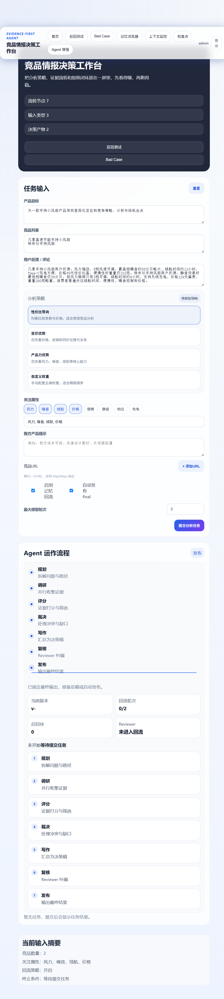
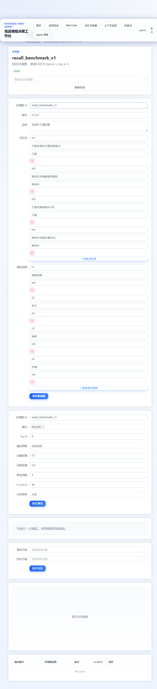
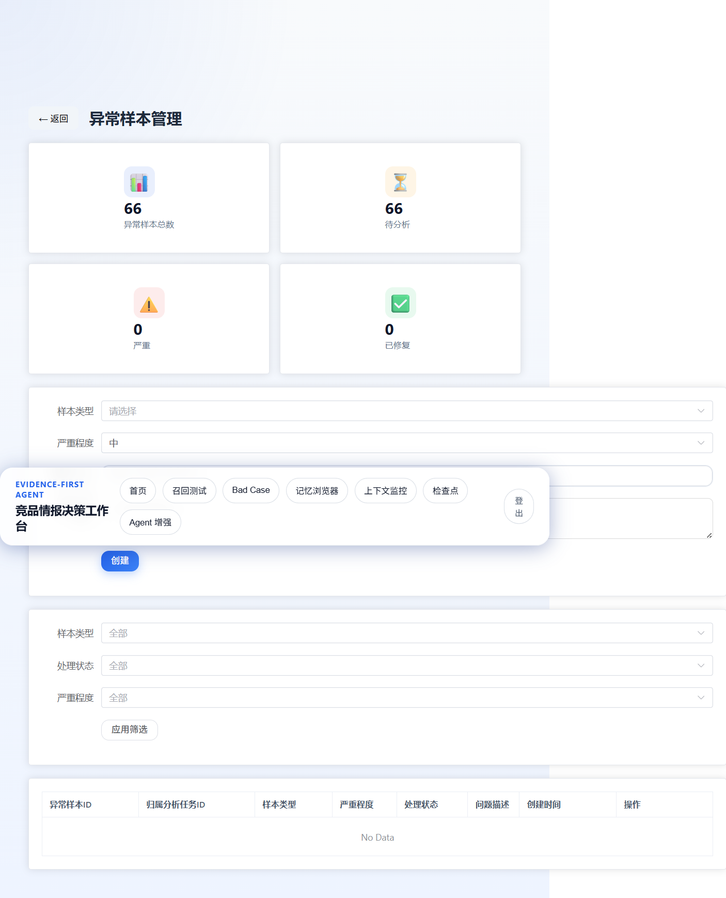
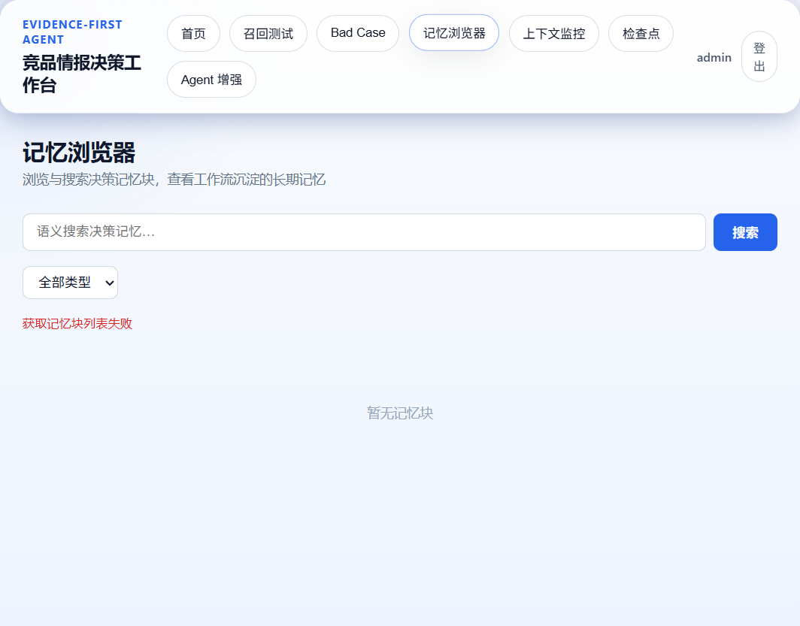
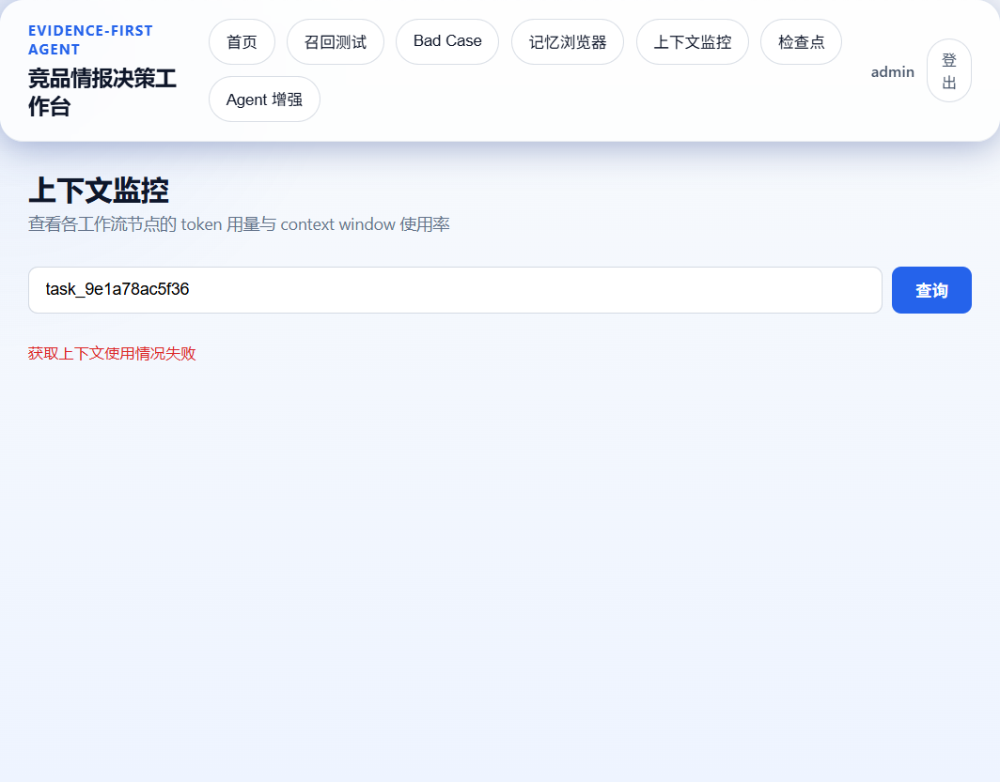
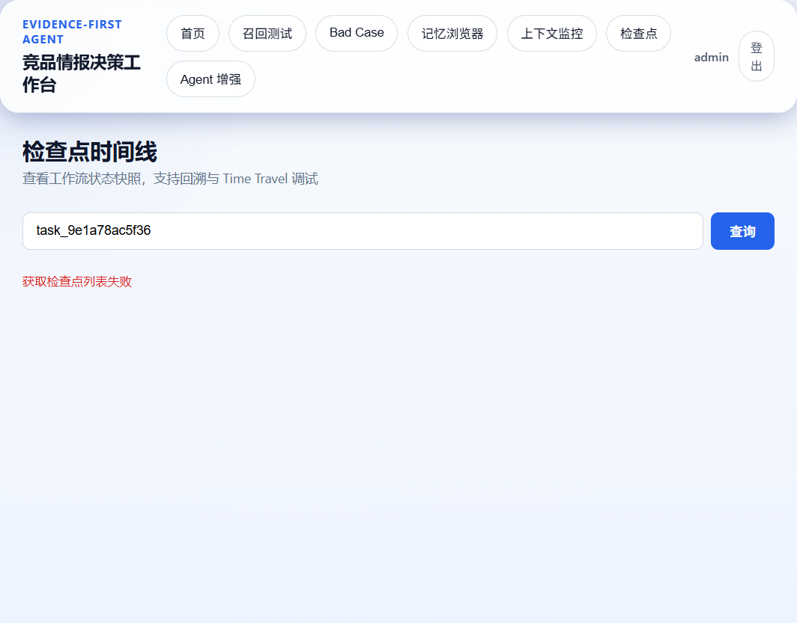

# 界面总览与截图

这份文档专门承载前端界面截图，避免主 `README.md` 过长。

> 说明：当前这批截图属于旧版运行时截面，部分任务标识仍是旧格式。
> 代码侧已经切到 `observable_id` / 更完整的任务展示口径，后续会重新补一轮最新截图。

## 页面清单

| 页面 | 路由 | 作用 |
| --- | --- | --- |
| 首页 | `/` | 任务提交、状态机总览、事件流和决策包展示 |
| 召回测试 | `/recall` | 召回基准测试、历史对比和结果评估 |
| 异常样本管理 | `/bad-cases` | 异常样本登记、筛选、处理和汇总 |
| 记忆浏览器 | `/memory` | 记忆块检索、过滤、展开查看 |
| 上下文监控 | `/context` | 各节点 token 使用情况与上下文占比 |
| 检查点时间线 | `/checkpoints` | 工作流检查点、状态快照与回溯信息 |
| Agent 增强 | `/agent-enhancements` | 运行时增强能力展示 |

## 首页

- 任务输入位于主区域左侧，策略、关注维度和竞品 URL 在同一屏完成配置
- 中间区域展示阶段链路和当前状态
- 下方区域展示事件流、决策包、记忆写入和复核结果

## 召回测试

- 支持创建评测集、运行测试、对比历史结果
- 用于验证检索策略、融合方式和召回质量

## 异常样本管理

- 记录召回失败、幻觉、覆盖缺口和证据冲突等问题
- 支持按类型、状态和严重程度筛选

## 记忆浏览器

- 查看记忆块、类型、排序方式和展开详情
- 支持按语义搜索记忆内容

## 上下文监控

- 观察各节点 prompt / completion token 消耗
- 直接看出哪些阶段最容易把上下文吃满

## 检查点时间线

- 展示 workflow checkpoint 的时间线
- 适合回溯中间状态和定位失败点

## Agent 增强

> 该页面偏运行时能力说明，截图可按实际浏览器状态补充。

- Checkpointer 持久化
- 死循环三层防御
- RetryPolicy 重试策略
- Human-in-the-loop
- JSON 稳定输出
- 并发 reducer
- 工作流恢复
- 上下文压缩
- Streaming / RAGAS / Memory